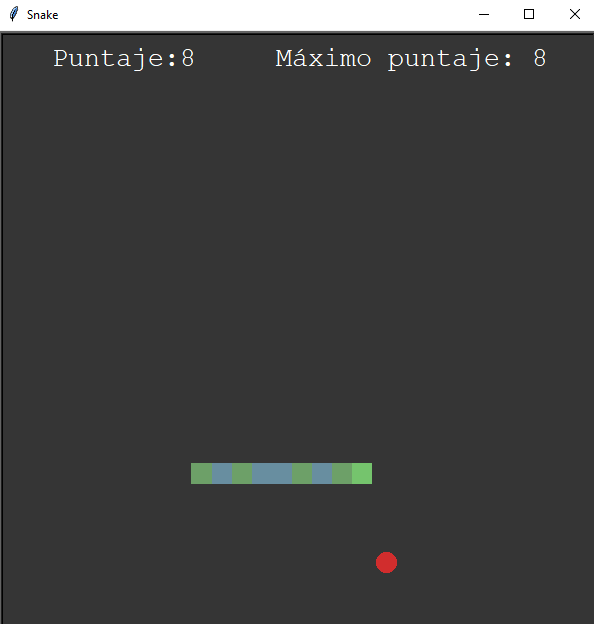

# Snake
## El juego de la serpiente hecho en python

El clásico juego de la serpiente, entre más coma manzanas más crece, desarrollado completamente en python y usando la librería turtle, sus reglas son:

- No tocar los bordes
- No comerse a sí misma
- Se maneja con las flechas del teclado

## Como descargarlo

- Importar el repositorio
- Ejecutar el archivo main.py
- Disfrutar el juego

## Prueba de juego

  

